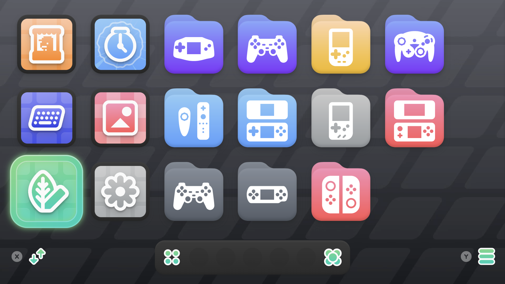

I did not want to turn on my AYN Thor and browse through a wall of Android apps or a list of folders. The goal was much simpler: choose a console, see its games, and play.

That sounds obvious, but it changes how the handheld should be set up. The useful unit is not an emulator. It is the game library.



My home screen is built around that idea. The first screen is a set of console collections. Select Nintendo DS, PlayStation Portable, GameCube, or another system and the second screen becomes that system's library. The games have box art, titles, and background images instead of filenames. It feels closer to a small personal console than a tiny Android tablet.

## Start with a library that can explain itself

The foundation is one simple folder structure:

```text
ROMs/
  gb/
  gba/
  nds/
  n3ds/
  psp/
  psx/
  ps2/
  gc/
  wii/
  switch/
```

Each game goes directly inside the folder for its platform. That one decision keeps the setup flexible. A frontend can recognize the platform automatically, an emulator can be pointed at one focused directory, and adding a game later does not require rebuilding the library by hand.

On the Thor, the library lives at `Internal storage/ROMs`. Android also calls this location `/sdcard/ROMs`, even when there is no physical microSD card installed. With the 256 GB model, the current collection fits comfortably, while still leaving space for applications, artwork, save files, and future games.

I only use games and system files that I am entitled to use. The folder layout is useful whether the library is made of personal dumps, homebrew, or public-domain software.

## Cocoon is the console home

I chose Cocoon as the main launcher because it is designed around the Thor's dual-screen shape. The top screen is the place to make a choice; the lower screen is the place to explore the result.

The default folder view is only the beginning. Cocoon's Smart Folders turn the platform folders into living console collections. A Nintendo DS collection follows `ROMs/nds`; a PSP collection follows `ROMs/psp`. New games appear in the appropriate place without dragging icons around a grid.

That is the part that removes the file-browser feeling. The home screen can lead with the systems I actually use rather than every emulator and utility installed on Android. My preferred order is:

1. Nintendo handhelds: Game Boy, Game Boy Advance, DS, and 3DS.
2. PlayStation: PS1, PS2, and PSP.
3. Home consoles: NES, SNES, Mega Drive, Nintendo 64, GameCube, Wii, and Dreamcast.
4. Modern systems: Switch and Wii U, once their own required setup is complete.

Each collection gets an appropriate platform icon, a distinct color, and eventually a matching hero image. The point is recognition: I should be able to glance at the screen and know where I am.

## Artwork does more than make the screen pretty

With the folders in place, I ran Cocoon's library scraper. It is matching 113 games and downloading cover art in the background. The difference is immediate: a game no longer reads as a long filename with region tags; it reads as the game I remember.

Good artwork gives a collection a visual hierarchy. Box art makes the grid scannable, logos make a selected game recognizable, and screenshots or hero art give the lower screen some personality. It also makes a mixed-era library feel coherent, whether the next game is a Game Boy title or a PSP game.

There will always be a few mismatches in a scrape, especially with homebrew, patches, alternate regions, and unusual naming. I treat those as a small finishing pass rather than a reason to abandon automatic scraping. The important work is letting the scraper handle the majority, then correcting the handful of games that need attention.

## Keep the launcher focused

An emulation handheld still needs the underlying apps. RetroArch handles many older systems, while dedicated emulators cover systems such as PSP, PlayStation, GameCube/Wii, DS, and 3DS. But those apps should stay behind the library interface whenever possible.

The ideal flow is short:

```text
Turn on Thor → choose a system → choose a game → play
```

You should not have to remember which emulator runs a platform, browse Android's app drawer, or navigate to a storage folder every time. The frontend owns discovery; the emulator owns compatibility and performance.

This separation also makes maintenance easier. I can tune an emulator for a platform once, while Cocoon continues to present the same clean game collection. A future emulator update does not require relearning the home screen.

## The last ten percent is visual restraint

It is tempting to add every widget, animation, and theme at once. I am doing the opposite. First, make sure every platform collection works and the artwork completes. Then choose one dark theme, keep the typography readable, and let the platform logos and game art carry the visual weight.

A good frontend should disappear when I am choosing a game. It should feel deliberate without becoming busy. That is why I am prioritizing platform art, readable covers, a consistent order, and a clean dual-screen layout over a dashboard full of menus.

The final test is simple: hand the Thor to someone who has never seen the setup. If they can find the console they want, choose a game, and start playing without asking which app to open, the frontend is doing its job.
